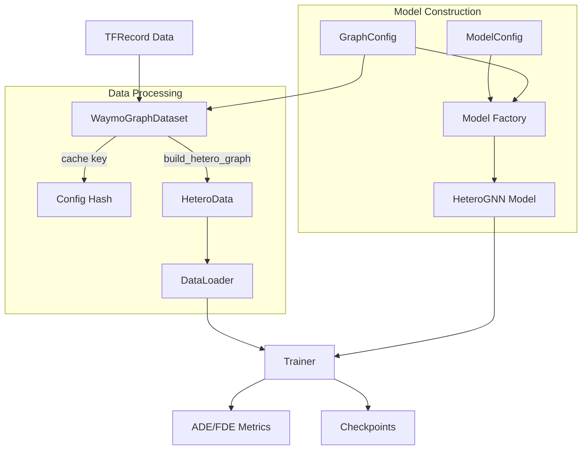

# GNN Pipeline Architecture

This document details the internal design and data flow of the `gnn_pipeline` package.

## 1. High-Level Architecture

The pipeline follows a modular design centered around **Configuration Objects** and a **Factory Pattern**.

## 2. Core Components

### 2.1 Configuration System (`configs/`)

Instead of passing dozens of arguments, the system uses two dataclasses:

- **`GraphConfig`**: Controls the *structure of the data*.
  - Determines which nodes (TLs?) and edges (A2A, L2L?) are built.
  - Used by `WaymoGraphDataset` to generate the graph.
  - Generates a unique `get_hash()` to cache processed datasets. If you change a graph parameter, the hash changes, and the dataset is re-processed automatically.

- **`ModelConfig`**: Controls the *neural network architecture*.
  - Determines layers, hidden dims, and conv types.
  - Syncs with `GraphConfig` via `sync_with_graph_config()` to ensure the model only expects edge types that actually exist in the graph.

### 2.2 Graph Building (`graphs/`)

- **`hetero_graph.py`**: The "builder" logic.
  - Loops over agents and lanes to compute geometric relationships.
  - Logic is gated by `GraphConfig` flags (e.g., if `include_l2l=False`, the O(N^2) lane loop is skipped entirely).
  - Outputs a PyG `HeteroData` object.
  - **NEW**: Supports advanced filtering modes for nodes and edges.

- **`edge_builders.py`**: Modular edge construction functions (NEW).
  - **A2A builders**: Multiple modes for agent-agent edges:
    - `ego_only`: Baseline (ego→others only)
    - `k_nearest`: Each agent connects to k nearest neighbors
    - `same_lane`: Only connect agents on same lane
    - `directional`: Only connect to agents in field of view
  - **L2L builders**: Typed lane-lane edges:
    - `all`: Single edge type for all lane connections
    - `typed`: LaneGCN-style (successor, predecessor, left_of, right_of)
    - `successor_only`: Only forward-direction connections
  - **TL filtering**: Remove irrelevant traffic lights
  - **Lane filtering**: Reduce lane count based on ego relevance

- **`graph_dataset.py`**: A `InMemoryDataset` wrapper.
  - Handles caching: `processed_file_names` includes the config hash (e.g., `data_all_33def853.pt`).
  - Supports `max_records` for quick debugging.
  - Cache automatically invalidates when `GraphConfig` changes.

### 2.3 Model Registry (`models/`)

- **Registry Pattern**:
  - Allows decoupling the exact model class from the training loop.
  - Use `@register_model("name")` to add new architectures without modifying `train.py`.

- **`BaseMotionPredictor`**:
  - All models must inherit from this.
  - Enforces a standard `forward(data, ego_indices)` interface.

#### Available Models

- **`SimpleHeteroGNN`** (`simple_gnn`):
  - Basic heterogeneous GNN with uniform message passing.
  - Dynamically builds `HeteroConv` layers based on the `edge_types` list passed at initialization.
  - Same class can function as Agent-Lane GNN or fully connected graph, depending on config.
  - **Best for**: Baseline experiments, fastest training.

- **`TypedHeteroGNN`** (`typed_gnn`) - NEW:
  - LaneGCN-inspired architecture with semantically-typed convolutions.
  - **Key features**:
    - Separate convolutions for each L2L relationship (successor, predecessor, left_of, right_of).
    - Typed A2A convolutions for different interaction types (following, leading, adjacent, etc.).
    - Agent-Lane fusion with bidirectional cross-attention.
    - Uses the `LaneGraphNetwork` layer for multi-hop lane reasoning.
  - **Best for**: Experiments with `l2l_mode="typed"` preset.
  - Located in `models/typed_gnn.py`.

- **`HierarchicalGNN`** (`hierarchical_gnn`) - NEW:
  - HiVT-inspired hierarchical encoder with multi-scale reasoning.
  - **Key features**:
    - Temporal transformers for agent history encoding.
    - Polyline encoders for lane geometry.
    - Local interaction via k-NN attention (nearby entities).
    - Global interaction via sparse attention (scene-level reasoning).
    - Ego-centric aggregation with cross-attention.
    - Multi-modal decoder: predicts K possible futures with confidences.
  - **Best for**: State-of-the-art performance (more compute intensive).
  - Located in `models/hierarchical_gnn.py`.

#### Model Layers (`models/layers/`)

Reusable components for building complex models:

- **`temporal_encoder.py`**:
  - `TemporalTransformerEncoder`: Transformer for agent history
  - `TemporalCNNEncoder`: CNN alternative for history encoding

- **`attention.py`**:
  - `CrossAttention`: Bidirectional cross-attention
  - `SparseAttention`: Efficient sparse attention for global reasoning
  - `LocalGlobalAttention`: Combined local + global attention

- **`lane_graph_network.py`**:
  - `LaneGraphNetwork`: Typed lane graph convolutions
  - `AgentLaneFusion`: Fusion layer for agent and lane features

- **`polyline_encoder.py`**:
  - Encodes lane polylines into vector representations

- **`multi_modal_decoder.py`**:
  - Decodes to K possible futures with confidences
  - Used by HierarchicalGNN for multi-modal prediction

### 2.4 Training Loop (`train/`)

- **`Trainer`**:
  - agnostic to the specific model architecture.
  - Handles the boiler-plate: device movement, optimizer stepping, scheduling, and metric aggregation.
  - Computes ADE/FDE using masked operations in `metrics.py`.

## 3. Data Flow in Detail

1. **Initialization**:
   - CLI parses args into `GraphConfig` and `ModelConfig`.
   - `WaymoGraphDataset` initialized with `GraphConfig`.

2. **Processing (First Run)**:
   - Dataset checks for `data_{hash}.pt`.
   - If missing, it calls `build_hetero_graph` for each TFExample.
   - `build_hetero_graph` uses `spatial_graph` utilities to extract raw numbers, then converts them to PyTorch tensors.
   - Graphs are saved to disk.

3. **Loading**:
   - `DataLoader` batches graphs.
   - **Crucial**: `custom_collate` (in `trainer.py` or `run.py`) handles `ego_indices`. When batching graphs, node indices shift. The loader adjusts `ego_idx` by the cumulative node count so the model knows which node is the ego in the batched giant graph.

4. **Forward Pass**:
   - Model receives `Batch` object.
   - `HeteroConv` passes messages on all present edge types.
   - Ego node embeddings are extracted using the adjusted indices.
   - Decoder projects embeddings to `[batch, 80, 2]` trajectories.

## 4. Advanced Features (NEW)

### 4.1 Adaptive Edge Construction

The pipeline now supports multiple edge construction strategies:

- **A2A modes**: Control agent-agent connectivity density
  - Trade-off: `ego_only` (sparse, fast) vs `k_nearest` (balanced) vs `all_pairs` (dense, slow)

- **L2L typing**: Semantic lane relationships
  - Trade-off: Single edge type (simple) vs typed edges (semantic, more parameters)

- **Filtering**: Reduce graph size by removing irrelevant nodes/edges
  - Trade-off: Smaller graphs (faster) vs full scene (more context)

### 4.2 Config-Driven Caching

- Graph processing is expensive, so the dataset caches processed graphs.
- Cache key = `GraphConfig.get_hash()` (MD5 of all config fields).
- **Changing any config parameter** triggers re-processing automatically.
- Example: `processed_graphs/data_all_33def853.pt` where `33def853` is the config hash.

### 4.3 Model-Graph Sync

- `ModelConfig.sync_with_graph_config(graph_config)` ensures model only expects edges that exist in the graph.
- Prevents runtime errors from missing edge types.
- Automatically called in `run.py`.

## 5. Extending the Pipeline

- **New Edge Type**:
  1. Update `GraphConfig` to add the flag.
  2. Add builder function in `edge_builders.py` or update `hetero_graph.py`.
  3. Update `GraphConfig.get_edge_types()` to include it in the list.
  4. Existing models will automatically pick it up.

- **New Edge Building Mode**:
  1. Add function to `edge_builders.py` (e.g., `build_a2a_edges_custom()`).
  2. Add mode option to `GraphConfig` (e.g., `a2a_mode="custom"`).
  3. Update `hetero_graph.py` to call your function based on mode.

- **New Model Architecture**:
  1. Create class in `models/` inheriting from `BaseMotionPredictor`.
  2. Decorate with `@register_model("your_name")`.
  3. Import in `models/__init__.py`.
  4. Run with `--model your_name`.

- **New Model Layer**:
  1. Create module in `models/layers/`.
  2. Use in your model class.
  3. Import in `models/layers/__init__.py`.

- **New Graph Preset**:
  1. Add `@classmethod` to `GraphConfig` (e.g., `my_preset(cls)`).
  2. Update `run.py` preset choices and `build_graph_config()` mapping.
  3. Use with `--graph_preset my_preset`.

- **New Metric**:
  1. Add function to `train/metrics.py`.
  2. Call it in `Trainer.train_epoch` or `Trainer.validate`.
  3. Log to console or plots as needed.

---

## 6. Implementation Status

### Currently Implemented

**Graph Construction:**
- ✅ Heterogeneous graphs with agents, lanes, and traffic lights
- ✅ Multiple A2A modes: `ego_only`, `k_nearest`, `same_lane`, `directional`
- ✅ Typed L2L edges: `all`, `typed` (LaneGCN-style), `successor_only`
- ✅ Traffic light filtering: `all`, `relevant`, `controlling`
- ✅ Lane filtering: `all`, `drivable`, `ego_relevant`, `ego_path`
- ✅ Config-based caching with automatic hash-based invalidation

**Models:**
- ✅ SimpleHeteroGNN: Basic heterogeneous GNN (baseline)
- ✅ TypedHeteroGNN: LaneGCN-inspired with semantic convolutions
- ✅ HierarchicalGNN: HiVT-inspired hierarchical encoder

**Training:**
- ✅ Config-driven training pipeline
- ✅ ADE/FDE metrics
- ✅ Checkpointing (best model by val ADE)
- ✅ Training curve plots
- ✅ Config serialization for reproducibility

**Presets:**
- ✅ Basic: `baseline`, `with_l2l`, `with_tl`, `with_full_a2a`, `full`
- ✅ Advanced: `smart_a2a_k5`, `typed_l2l`, `filtered_tl`, `optimized`

### Best Performance So Far

**Config**: `baseline` (agents + lanes, ego→others A2A)
**Model**: `simple_gnn` (128 hidden, 3 layers, SAGE)
**Metrics**: ~4.3-4.5m val ADE, ~12-13m val FDE

**Next Steps for Improvement:**
1. Test `typed_gnn` with `typed_l2l` preset
2. Explore `hierarchical_gnn` for state-of-the-art performance
3. Tune `smart_a2a_k5` with different k values
4. Experiment with model size (hidden, layers)

---

## 7. Documentation Guide

- **PIPELINE_GUIDE.md**: User-facing guide for running experiments
- **CONFIG_REFERENCE.md**: Complete reference for all configuration options
- **ARCHITECTURE.md** (this file): Internal design and implementation details

For quick start and experimentation, see **PIPELINE_GUIDE.md**.
For detailed config options and tuning, see **CONFIG_REFERENCE.md**.
