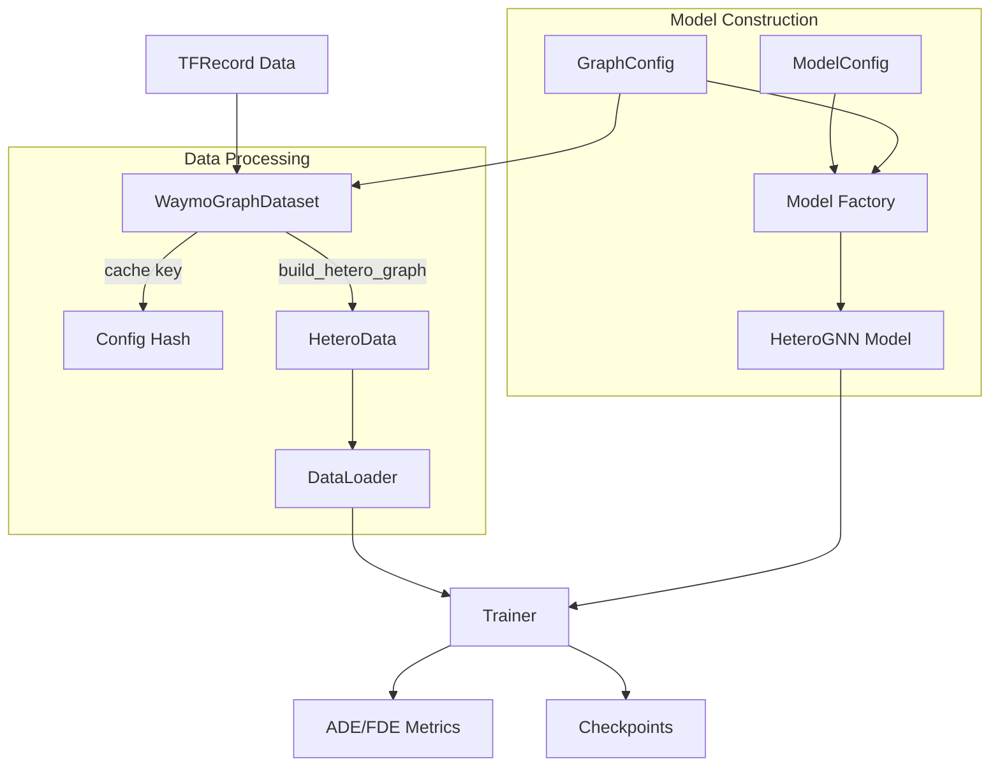

# GNN Pipeline Architecture

This document details the internal design and data flow of the `gnn_pipeline` package.

## 1. High-Level Architecture

The pipeline follows a modular design centered around **Configuration Objects** and a **Factory Pattern**.

## 2. Core Components

### 2.1 Configuration System (`configs/`)

Instead of passing dozens of arguments, the system uses two dataclasses:

- **`GraphConfig`**: Controls the *structure of the data*.
  - Determines which nodes (TLs?) and edges (A2A, L2L?) are built.
  - Used by `WaymoGraphDataset` to generate the graph.
  - Generates a unique `get_hash()` to cache processed datasets. If you change a graph parameter, the hash changes, and the dataset is re-processed automatically.

- **`ModelConfig`**: Controls the *neural network architecture*.
  - Determines layers, hidden dims, and conv types.
  - Syncs with `GraphConfig` via `sync_with_graph_config()` to ensure the model only expects edge types that actually exist in the graph.

### 2.2 Graph Building (`graphs/`)

- **`hetero_graph.py`**: The "builder" logic.
  - Loops over agents and lanes to compute geometric relationships.
  - Logic is gated by `GraphConfig` flags (e.g., if `include_l2l=False`, the O(N^2) lane loop is skipped entirely).
  - Outputs a PyG `HeteroData` object.

- **`graph_dataset.py`**: A `InMemoryDataset` wrapper.
  - Handles caching: `processed_file_names` includes the config hash (e.g., `data_all_33def853.pt`).
  - Supports `max_records` for quick debugging.

### 2.3 Model Registry (`models/`)

- **Registry Pattern**: 
  - Allows decoupling the exact model class from the training loop.
  - Use `@register_model("name")` to add new architectures without modifying `train.py`.
  
- **`BaseMotionPredictor`**: 
  - All models must inherit from this.
  - Enforces a standard `forward(data, ego_indices)` interface.

- **`SimpleHeteroGNN`**:
  - Dynamically builds `HeteroConv` layers based on the `edge_types` list passed at initialization.
  - This means the exact same class can function as an Agent-Lane GNN or a fully connected interaction graph GNN, depending on config.

### 2.4 Training Loop (`train/`)

- **`Trainer`**:
  - agnostic to the specific model architecture.
  - Handles the boiler-plate: device movement, optimizer stepping, scheduling, and metric aggregation.
  - Computes ADE/FDE using masked operations in `metrics.py`.

## 3. Data Flow in Detail

1. **Initialization**:
   - CLI parses args into `GraphConfig` and `ModelConfig`.
   - `WaymoGraphDataset` initialized with `GraphConfig`.

2. **Processing (First Run)**:
   - Dataset checks for `data_{hash}.pt`.
   - If missing, it calls `build_hetero_graph` for each TFExample.
   - `build_hetero_graph` uses `spatial_graph` utilities to extract raw numbers, then converts them to PyTorch tensors.
   - Graphs are saved to disk.

3. **Loading**:
   - `DataLoader` batches graphs.
   - **Crucial**: `custom_collate` (in `trainer.py` or `run.py`) handles `ego_indices`. When batching graphs, node indices shift. The loader adjusts `ego_idx` by the cumulative node count so the model knows which node is the ego in the batched giant graph.

4. **Forward Pass**:
   - Model receives `Batch` object.
   - `HeteroConv` passes messages on all present edge types.
   - Ego node embeddings are extracted using the adjusted indices.
   - Decoder projects embeddings to `[batch, 80, 2]` trajectories.

## 4. Extending the Pipeline

- **New Edge Type**:
  1. Update `GraphConfig` to add the flag.
  2. Update `hetero_graph.py` to build the edge index.
  3. Update `ModelConfig.get_edge_types()` to include it in the list.
  4. The `SimpleHeteroGNN` will automatically pick it up and assign a generic convolution to it.

- **New Model Architecture**:
  1. Create class in `models/`.
  2. Decorate with `@register_model`.
  3. Run with `--model new_name`.

- **New Metric**:
  1. Add function to `train/metrics.py`.
  2. Call it in `Trainer.train_epoch`.
